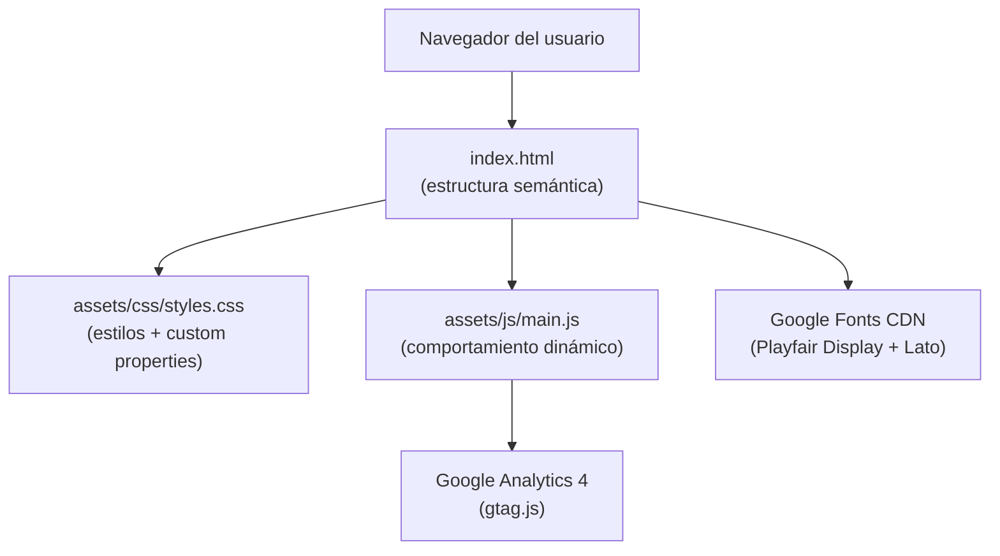

# Documento de Diseño Técnico — Web Despacho de Abogados

## Overview

Este documento describe la arquitectura técnica y las decisiones de diseño para la web corporativa de un despacho de abogados. Se trata de una Single Page Application (SPA) estática construida íntegramente con HTML5 semántico, CSS3 (custom properties, Flexbox, Grid) y JavaScript ES6+ puro, sin dependencias de frameworks.

**Principios guía:**

- **Mobile-first**: los estilos base se definen para dispositivos pequeños (≥ 320 px) y se amplían con media queries ascendentes.
- **Rendimiento**: un único archivo CSS externo y un único archivo JS externo; imágenes con `loading="lazy"`; fuentes de Google Fonts con `display=swap`.
- **Accesibilidad WCAG 2.1 AA**: ratio de contraste ≥ 4.5:1, navegación completa por teclado, atributos ARIA donde sea necesario.
- **SEO técnico**: etiquetas HTML5 semánticas, H1 único, H2 por sección, meta description, Open Graph y Schema.org básico.
- **Analítica**: Google Analytics 4 con seguimiento de pageview, clics en CTA y envío de formulario.

---

## Architecture

### Estructura de archivos del proyecto

```
anagonzalezabogada/
├── index.html              # Única página HTML
├── assets/
│   ├── css/
│   │   └── styles.css      # Hoja de estilos principal (único archivo CSS)
│   ├── js/
│   │   └── main.js         # Lógica JS principal (único archivo JS)
│   └── images/
│       ├── hero-bg.webp    # Imagen de fondo del Hero
│       ├── lawyer-1.webp   # Fotografía abogada principal
│       └── logo.svg        # Logotipo del despacho
└── .kiro/
    └── specs/
        └── law-firm-website/
```

**Decisión de diseño:** se mantiene el proyecto sin bundler ni transpilador para minimizar la complejidad operativa y respetar la restricción de "sin frameworks". Los módulos ES6 se evitan para garantizar compatibilidad directa con el navegador sin pasos de compilación.

### Diagrama de arquitectura



---

## Components and Interfaces

### 1. Navigation Bar

**Estructura HTML:**
```html
<header class="site-header" role="banner">
  <nav class="navbar" aria-label="Navegación principal">
    <a class="navbar__logo" href="#inicio" aria-label="Ana González Abogada — Inicio">
      
    </a>
    <ul class="navbar__links" role="list">
      <li><a href="#inicio">Inicio</a></li>
      <li><a href="#servicios">Servicios</a></li>
      <li><a href="#nosotros">Nosotros</a></li>
      <li><a href="#contacto">Contacto</a></li>
    </ul>
    <button class="navbar__toggle" aria-expanded="false" aria-controls="nav-menu" aria-label="Abrir menú de navegación">
      <span class="hamburger-icon" aria-hidden="true"></span>
    </button>
  </nav>
</header>
```

**Comportamiento:**
- `position: fixed; top: 0;` siempre visible.
- Al superar 80 px de scroll: clase `.navbar--scrolled` → fondo `#0D2545` con `box-shadow`.
- En viewport < 768 px: `.navbar__links` oculta; botón hamburguesa visible.
- Al pulsar el botón: `aria-expanded` alterna entre `"true"/"false"`; menú desplegable se muestra/oculta con transición CSS.
- Click fuera del menú → cierre del desplegable (listener en `document`).
- Scroll suave: `scroll-behavior: smooth` en `html` + `scrollIntoView({behavior:'smooth'})` como fallback.

### 2. Hero Section

**Estructura HTML:**
```html
<section id="inicio" class="hero" aria-labelledby="hero-heading">
  <div class="hero__content">
    <h1 id="hero-heading" class="hero__title">Ana González Abogada</h1>
    <p class="hero__tagline">Defendemos tus derechos con experiencia y dedicación</p>
    <div class="hero__ctas">
      <a href="#contacto" class="btn btn--primary js-cta" data-cta-name="hero_contacto">
        Solicitar consulta
      </a>
      <a href="#servicios" class="btn btn--secondary js-cta" data-cta-name="hero_servicios">
        Nuestros servicios
      </a>
    </div>
  </div>
</section>
```

**Comportamiento:**
- `min-height: 100svh` (con fallback `100vh`) para ocupar todo el viewport.
- Fondo: imagen WebP con degradado superpuesto `linear-gradient(135deg, rgba(13,37,69,.85) 0%, rgba(13,37,69,.6) 100%)`.
- `object-fit: cover` + `background-attachment: fixed` en desktop para efecto parallax ligero.
- Tipografía responsiva con `clamp()`.

### 3. Services Section

**Estructura HTML (tarjeta tipo):**
```html
<section id="servicios" class="services" aria-labelledby="services-heading">
  <h2 id="services-heading">Áreas de Práctica</h2>
  <ul class="services__grid" role="list">
    <li class="service-card">
      <span class="service-card__icon" aria-hidden="true">⚖️</span>
      <h3 class="service-card__title">Derecho Civil</h3>
      <p class="service-card__desc">Asesoramiento integral en contratos, herencias y reclamaciones civiles.</p>
    </li>
    <!-- ×6 tarjetas mínimo -->
  </ul>
</section>
```

**Áreas de práctica incluidas:** Derecho Civil, Derecho Mercantil, Derecho Laboral, Derecho Penal, Derecho de Familia, Derecho Inmobiliario.

**Comportamiento responsive:**
- < 768 px → 1 columna (`grid-template-columns: 1fr`)
- 768–1023 px → 2 columnas
- ≥ 1024 px → 3 columnas

**Hover (dispositivos con puntero):**
```css
@media (hover: hover) {
  .service-card:hover {
    transform: translateY(-6px);
    border-color: var(--color-accent);
    box-shadow: 0 8px 24px rgba(0,0,0,.15);
    transition: transform 300ms ease, border-color 300ms ease, box-shadow 300ms ease;
  }
}
```

### 4. About Section

**Estructura HTML:**
```html
<section id="nosotros" class="about" aria-labelledby="about-heading">
  <h2 id="about-heading">Sobre el Despacho</h2>
  <div class="about__layout">
    <div class="about__text">
      <p>Historia, misión y valores…</p>
    </div>
    <div class="about__profiles">
      <article class="lawyer-card">
        
        <h3>Ana González</h3>
        <p class="lawyer-card__specialty">Derecho Civil · Derecho de Familia</p>
        <p class="lawyer-card__bio">Más de 15 años de experiencia…</p>
      </article>
    </div>
  </div>
</section>
```

**Comportamiento responsive:**
- < 768 px → columna única apilada
- ≥ 768 px → dos columnas 60/40 con CSS Grid

### 5. Contact Section

**Estructura HTML:**
```html
<section id="contacto" class="contact" aria-labelledby="contact-heading">
  <h2 id="contact-heading">Contacto</h2>
  <div class="contact__layout">
    <form id="contact-form" class="contact-form" novalidate aria-label="Formulario de contacto">
      <div class="form-group">
        <label for="field-name">Nombre completo <span aria-hidden="true">*</span></label>
        <input type="text" id="field-name" name="name" required autocomplete="name"
               aria-required="true" aria-describedby="error-name">
        <span id="error-name" class="form-error" role="alert" aria-live="polite"></span>
      </div>
      <div class="form-group">
        <label for="field-email">Correo electrónico <span aria-hidden="true">*</span></label>
        <input type="email" id="field-email" name="email" required autocomplete="email"
               aria-required="true" aria-describedby="error-email">
        <span id="error-email" class="form-error" role="alert" aria-live="polite"></span>
      </div>
      <div class="form-group">
        <label for="field-phone">Teléfono</label>
        <input type="tel" id="field-phone" name="phone" autocomplete="tel">
      </div>
      <div class="form-group">
        <label for="field-subject">Asunto <span aria-hidden="true">*</span></label>
        <input type="text" id="field-subject" name="subject" required aria-required="true" aria-describedby="error-subject">
        <span id="error-subject" class="form-error" role="alert" aria-live="polite"></span>
      </div>
      <div class="form-group">
        <label for="field-message">Mensaje <span aria-hidden="true">*</span></label>
        <textarea id="field-message" name="message" rows="5" required
                  aria-required="true" aria-describedby="error-message"></textarea>
        <span id="error-message" class="form-error" role="alert" aria-live="polite"></span>
      </div>
      <button type="submit" class="btn btn--primary js-cta" data-cta-name="form_submit">
        Enviar consulta
      </button>
      <div id="form-success" class="form-success" role="alert" aria-live="polite" hidden>
        ¡Gracias! Hemos recibido tu consulta y te contactaremos pronto.
      </div>
    </form>
    <address class="contact-info">
      <p><strong>Dirección:</strong> Calle Gran Vía 1, Madrid</p>
      <p><strong>Teléfono:</strong> <a href="tel:+34910000000">+34 910 000 000</a></p>
      <p><strong>Email:</strong> <a href="mailto:info@anagonzalezabogada.es">info@anagonzalezabogada.es</a></p>
    </address>
  </div>
</section>
```

### 6. Footer

**Estructura HTML:**
```html
<footer class="site-footer" role="contentinfo">
  <div class="footer__layout">
    <div class="footer__brand">
      <p class="footer__name">Ana González Abogada</p>
      <p class="footer__copy">© <span id="footer-year"></span> Todos los derechos reservados.</p>
    </div>
    <nav class="footer__legal" aria-label="Navegación legal">
      <a href="/privacidad.html">Política de Privacidad</a>
      <a href="/aviso-legal.html">Aviso Legal</a>
    </nav>
    <div class="footer__social">
      <a href="https://linkedin.com/in/anagonzalez" target="_blank" rel="noopener noreferrer"
         aria-label="Perfil de LinkedIn de Ana González Abogada">
        <svg aria-hidden="true" focusable="false"><!-- LinkedIn SVG --></svg>
      </a>
    </div>
  </div>
</footer>
```

El año se inyecta con `document.getElementById('footer-year').textContent = new Date().getFullYear()`.

---

## Data Models

### Sistema de Diseño Visual

#### Paleta de colores (CSS Custom Properties)

```css
:root {
  /* Primarios */
  --color-primary:       #0D2545; /* Azul marino profundo */
  --color-primary-light: #1A3A6B; /* Azul marino claro (hover) */

  /* Acento */
  --color-accent:        #C9A84C; /* Dorado corporativo */
  --color-accent-hover:  #A8872E; /* Dorado oscuro */

  /* Neutros */
  --color-white:         #FFFFFF;
  --color-off-white:     #F8F7F4; /* Fondos de sección alternos */
  --color-text:          #1C1C1E; /* Texto principal */
  --color-text-muted:    #5A5A6E; /* Texto secundario */
  --color-border:        #DDD8CE; /* Bordes de tarjetas */

  /* Estado */
  --color-error:         #C0392B;
  --color-success:       #1A7A45;
}
```

**Ratios de contraste verificados (WCAG 2.1 AA):**
- `--color-text` (#1C1C1E) sobre `--color-off-white` (#F8F7F4): **18.7:1** ✅
- `--color-white` (#FFF) sobre `--color-primary` (#0D2545): **14.2:1** ✅
- `--color-accent` (#C9A84C) sobre `--color-primary` (#0D2545): **5.1:1** ✅

#### Tipografía

```css
:root {
  /* Fuentes */
  --font-heading: 'Playfair Display', Georgia, serif;
  --font-body:    'Lato', system-ui, sans-serif;

  /* Escala tipográfica (base 16px) */
  --text-xs:   0.75rem;   /*  12px */
  --text-sm:   0.875rem;  /*  14px */
  --text-base: 1rem;      /*  16px */
  --text-lg:   1.125rem;  /*  18px */
  --text-xl:   1.25rem;   /*  20px */
  --text-2xl:  1.5rem;    /*  24px */
  --text-3xl:  1.875rem;  /*  30px */
  --text-4xl:  2.25rem;   /*  36px */
  --text-5xl:  3rem;      /*  48px */

  /* Responsive Hero H1 */
  --hero-title-size: clamp(2rem, 5vw + 1rem, 4rem);
}
```

Google Fonts se carga con `display=swap` y preconnect:
```html
<link rel="preconnect" href="https://fonts.googleapis.com">
<link rel="preconnect" href="https://fonts.gstatic.com" crossorigin>
<link href="https://fonts.googleapis.com/css2?family=Lato:wght@400;700&family=Playfair+Display:wght@400;700&display=swap" rel="stylesheet">
```

#### Espaciado y breakpoints

```css
:root {
  /* Espaciado (escala 4px) */
  --space-1:  0.25rem;  /*  4px */
  --space-2:  0.5rem;   /*  8px */
  --space-3:  0.75rem;  /* 12px */
  --space-4:  1rem;     /* 16px */
  --space-6:  1.5rem;   /* 24px */
  --space-8:  2rem;     /* 32px */
  --space-12: 3rem;     /* 48px */
  --space-16: 4rem;     /* 64px */
  --space-24: 6rem;     /* 96px */

  /* Anchos */
  --max-width: 1200px;
  --nav-height: 72px;
}

/* Breakpoints mobile-first */
/* Base: 0px - 479px  (móvil pequeño) */
/* sm:  480px+        (móvil estándar) */
/* md:  768px+        (tablet)        */
/* lg:  1024px+       (desktop)       */
/* xl:  1280px+       (desktop grande) */
```

### Modelo de datos del formulario

```javascript
/**
 * @typedef {Object} ContactFormData
 * @property {string} name     - Nombre completo (obligatorio, min 2 chars)
 * @property {string} email    - Email (obligatorio, formato RFC 5322)
 * @property {string} [phone]  - Teléfono (opcional)
 * @property {string} subject  - Asunto (obligatorio, min 3 chars)
 * @property {string} message  - Mensaje (obligatorio, min 10 chars)
 */

/**
 * @typedef {Object} ValidationResult
 * @property {boolean} isValid
 * @property {Object.<string, string>} errors  - Mapa campo → mensaje de error
 */
```

### Modelo de eventos GA4

```javascript
/**
 * @typedef {Object} GA4Event
 * @property {string} event_name   - Nombre del evento GA4
 * @property {string} cta_name     - Identificador del CTA (data-cta-name)
 * @property {string} [page_path]  - Ruta de la página (pageview)
 */

// Eventos registrados:
// - page_view        → carga inicial
// - cta_click        → click en cualquier .js-cta
// - form_submission  → envío correcto del formulario
```

---

## Correctness Properties

*Una propiedad es una característica o comportamiento que debe ser cierto en todas las ejecuciones válidas del sistema — esencialmente, un enunciado formal sobre lo que el sistema debe hacer. Las propiedades sirven de puente entre las especificaciones legibles por humanos y las garantías de corrección verificables por máquinas.*

### Property 1: Validación rechaza campos obligatorios vacíos o con solo espacios en blanco

*Para cualquier* objeto `ContactFormData` en el que uno o más campos obligatorios (nombre, email, asunto, mensaje) sean cadenas vacías o contengan únicamente caracteres de espacio en blanco (`\s`), la función `validateForm` SHALL devolver `{ isValid: false }` con al menos una entrada en el mapa de errores por cada campo inválido.

**Validates: Requirements 5.2**

### Property 2: Validación rechaza emails con formato incorrecto

*Para cualquier* cadena de texto no vacía que no cumpla el formato estándar de email (sin `@`, con múltiples `@`, sin dominio, sin TLD, etc.), la función `validateForm` SHALL devolver `{ isValid: false }` con un error en el campo `email`.

**Validates: Requirements 5.3**

### Property 3: Validación acepta formularios completamente válidos

*Para cualquier* objeto `ContactFormData` en el que todos los campos obligatorios tengan valores no vacíos y no compuestos únicamente de espacios en blanco, y el campo email tenga formato válido de dirección de correo, la función `validateForm` SHALL devolver `{ isValid: true }` con un mapa de errores vacío.

**Validates: Requirements 5.2, 5.3, 5.4**

### Property 4: Round-trip de serialización del formulario

*Para cualquier* objeto `ContactFormData` válido, la operación de leer los valores del formulario DOM después de haberlos escrito (simular relleno de campos) SHALL producir exactamente los mismos valores originales, sin pérdida, truncamiento ni transformación de datos.

**Validates: Requirements 5.1, 5.4**

### Property 5: Formato de año en footer

*Para cualquier* número entero en el rango [2000, 2100], la función `getFooterYear(year)` SHALL producir una cadena de exactamente 4 dígitos que represente ese año, sin prefijos, sufijos ni caracteres adicionales.

**Validates: Requirements 6.1**

### Property 6: Lógica de scroll activa la clase de navbar superado el umbral

*Para cualquier* valor numérico de `scrollY` estrictamente mayor que 80, la función que determina el estado visual de la navbar SHALL aplicar la clase `.navbar--scrolled`; y para cualquier valor menor o igual a 80, SHALL no aplicarla.

**Validates: Requirements 1.3**

### Property 7: Toggle del menú hamburguesa invierte siempre el estado

*Para cualquier* estado booleano de apertura del menú de navegación (`isOpen`), invocar la función de toggle SHALL producir el estado opuesto (`!isOpen`). Invocar el toggle dos veces seguidas SHALL devolver el estado original (idempotencia por pares).

**Validates: Requirements 1.5**

### Property 8: Tracking GA4 se dispara para cualquier elemento CTA

*Para cualquier* elemento del DOM que tenga la clase `js-cta` y un atributo `data-cta-name` no vacío, al recibir un evento `click`, la función `trackEvent` SHALL ser invocada exactamente una vez con `event_name = 'cta_click'` y `cta_name` igual al valor del atributo `data-cta-name` del elemento.

**Validates: Requirements 10.2**

---

## Error Handling

### Formulario de contacto

| Condición | Respuesta del sistema |
|---|---|
| Campo obligatorio vacío | Mensaje bajo el campo: "Este campo es obligatorio" |
| Email con formato inválido | Mensaje bajo el campo: "Introduce un correo electrónico válido" |
| Envío correcto | Ocultar formulario, mostrar `#form-success`, limpiar campos, disparar evento GA4 |
| Error de red (si se integra backend) | Mensaje genérico de error sin exponer detalles técnicos |

**Accesibilidad de errores:**
- Los mensajes de error usan `role="alert"` y `aria-live="polite"` para ser anunciados por lectores de pantalla.
- Al fallar la validación, el foco se mueve programáticamente al primer campo inválido.

### JavaScript

- Todos los event listeners se envuelven en bloques `try/catch` con logging en `console.error` (no expuesto al usuario).
- La inicialización de GA4 se protege con comprobación de existencia de `window.gtag` antes de disparar eventos.
- El scroll suave tiene fallback para navegadores que no soporten `scrollIntoView` con opciones.

### CSS / Rendering

- Las fuentes tienen `font-family` con fallback del sistema para evitar FOUT severo.
- Las imágenes tienen `width` y `height` explícitos para evitar Cumulative Layout Shift (CLS).
- El scroll horizontal se bloquea con `overflow-x: hidden` en `body`.

---

## Estrategia SEO Técnica

### Estructura semántica HTML5

```html
<head>
  <meta charset="UTF-8">
  <meta name="viewport" content="width=device-width, initial-scale=1.0">
  <title>Ana González Abogada | Despacho de Abogados en Madrid</title>

  <!-- Meta description (120-160 caracteres) -->
  <meta name="description" content="Despacho de abogados en Madrid especializado en Derecho Civil, Mercantil, Laboral y de Familia. Consulta gratuita. Llámanos o escríbenos hoy.">

  <!-- Open Graph -->
  <meta property="og:title"       content="Ana González Abogada | Despacho de Abogados en Madrid">
  <meta property="og:description" content="Despacho de abogados en Madrid especializado en Derecho Civil, Mercantil, Laboral y de Familia.">
  <meta property="og:image"       content="https://anagonzalezabogada.es/assets/images/og-image.jpg">
  <meta property="og:url"         content="https://anagonzalezabogada.es">
  <meta property="og:type"        content="website">
  <meta property="og:locale"      content="es_ES">

  <!-- Canonical -->
  <link rel="canonical" href="https://anagonzalezabogada.es">
</head>
```

**Jerarquía de encabezados:**
- `<h1>`: "Ana González Abogada" (único, en el Hero) — Requisito 9.1
- `<h2>`: "Áreas de Práctica", "Sobre el Despacho", "Contacto" — Requisito 9.2
- `<h3>`: nombres de servicios, nombres de abogados

### Google Analytics 4

**Snippet de inicialización** (en `<head>`, antes del cierre):
```html
<!-- Google tag (gtag.js) -->
<script async src="https://www.googletagmanager.com/gtag/js?id=G-XXXXXXXXXX"></script>
<script>
  window.dataLayer = window.dataLayer || [];
  function gtag(){dataLayer.push(arguments);}
  gtag('js', new Date());
  gtag('config', 'G-XXXXXXXXXX');
</script>
```

**Tracking de eventos en `main.js`:**
```javascript
// Función auxiliar segura
function trackEvent(eventName, params = {}) {
  if (typeof window.gtag === 'function') {
    window.gtag('event', eventName, params);
  }
}

// CTA clicks — todos los elementos con clase .js-cta
document.querySelectorAll('.js-cta').forEach(el => {
  el.addEventListener('click', () => {
    trackEvent('cta_click', { cta_name: el.dataset.ctaName });
  });
});

// Envío del formulario
document.getElementById('contact-form').addEventListener('submit', (e) => {
  e.preventDefault();
  const result = validateForm(getFormData());
  if (result.isValid) {
    showSuccessMessage();
    trackEvent('form_submission', { form_id: 'contact_form' });
  } else {
    displayErrors(result.errors);
    focusFirstError();
  }
});
```

---

## Testing Strategy

### Enfoque dual: tests unitarios + tests basados en propiedades

Dado que el proyecto incluye lógica de validación pura en JavaScript (funciones sin efectos secundarios con entrada/salida bien definida), el enfoque de **Property-Based Testing (PBT)** es aplicable a la capa de validación del formulario y a las funciones utilitarias.

**Biblioteca recomendada:** [fast-check](https://github.com/dubzzz/fast-check) (compatible con proyectos JS sin bundler mediante CDN o import ESM en tests).

**Tests unitarios** (con un framework ligero como [uvu](https://github.com/lukeed/uvu) o Jest):
- Casos concretos de validación (email válido, email inválido, campo vacío)
- Comportamiento del menú hamburguesa
- Inyección del año en el footer
- Tracking de eventos GA4 con mock de `window.gtag`
- Scroll suave: verificar que `scrollIntoView` se llama con los parámetros correctos

**Tests de propiedad** (fast-check, mínimo 100 iteraciones por propiedad):

Cada test de propiedad debe etiquetarse con el siguiente formato de comentario:
```javascript
// Feature: law-firm-website, Property N: <texto de la propiedad>
```

| Propiedad | Estrategia de generación | Iteraciones mínimas |
|---|---|---|
| P1: Validación rechaza campos vacíos/whitespace | Generar `ContactFormData` con uno o más campos obligatorios en blanco o compuestos solo de `\s` | 100 |
| P2: Validación rechaza emails incorrectos | Generar strings arbitrarios que no cumplan el formato email (sin `@`, sin TLD, etc.) | 100 |
| P3: Validación acepta formularios completos | Generar objetos `ContactFormData` completamente válidos | 100 |
| P4: Round-trip de serialización | Generar `ContactFormData` válidos, escribir en DOM, leer y comparar | 100 |
| P5: Formato de año en footer | Generar enteros en rango 2000–2100 | 100 |
| P6: Umbral de scroll de navbar | Generar valores numéricos de `scrollY` (positivos y negativos) | 100 |
| P7: Toggle idempotente del menú | Generar estado booleano inicial aleatorio, verificar inversión y round-trip | 100 |
| P8: Tracking GA4 de CTAs | Generar elementos CTA con distintos valores de `data-cta-name` | 100 |

**Tests de integración / snapshot** (no adecuados para PBT):
- Verificar que el layout responsive es correcto a 375 px, 768 px, 1024 px (Playwright o Cypress).
- Verificar que el score Lighthouse Accessibility es ≥ 90.
- Verificar la carga funcional en Chrome, Firefox, Safari y Edge (Requisito 8.1).

**Tests de accesibilidad:**
- Auditoría automática con [axe-core](https://github.com/dequelabs/axe-core) integrada en los tests E2E.
- Validación manual con NVDA/VoiceOver para garantizar el uso del teclado y los lectores de pantalla.

> **Nota:** La validación completa de la conformidad WCAG 2.1 AA requiere pruebas manuales con tecnologías de asistencia y revisión experta en accesibilidad, además de las pruebas automáticas.
